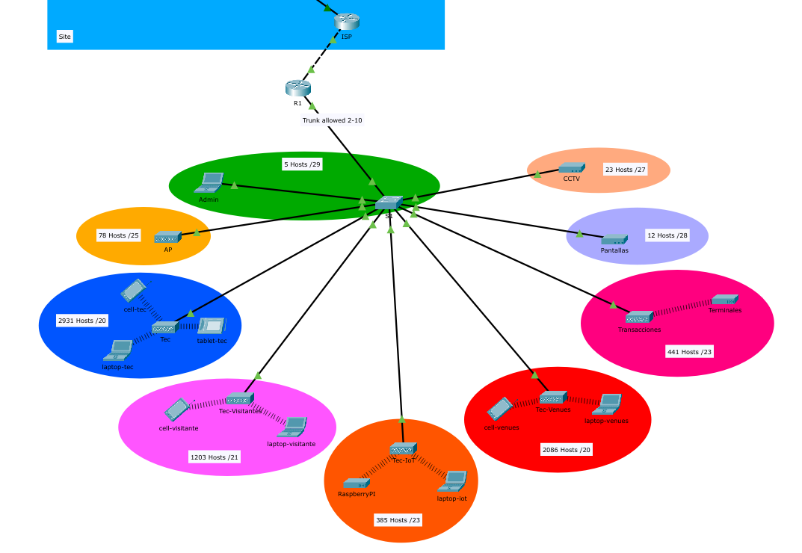

# Network Reengineering - Tecnológico de Monterrey Campus Guadalajara

## Overview

This project presents a comprehensive network infrastructure redesign for the Central Plaza and Congress Center Garden at Tecnológico de Monterrey, Guadalajara Campus. The solution addresses current connectivity demands while ensuring scalability, security, and seamless integration with existing campus networks.

## Project Context

The campus is experiencing significant growth in its communal spaces, with plans to expand to **9 food establishments by 2025**. This expansion brings new commercial establishments and increased student activity, requiring a robust and efficient wireless connectivity infrastructure to ensure optimal performance.

The existing network must evolve to integrate new access points without compromising stability. This challenge is compounded by the need to maintain operational continuity throughout the implementation process, avoiding interruptions that could affect user experience.

## Problem Statement

The network infrastructure must meet the growing demand for wireless connectivity, integrate a larger number of devices, and ensure stable communication for essential services such as security cameras and digital advertising. Any integration failure would affect campus operations, causing economic losses and deteriorating the student experience.

### Key Challenges

- **Commercial Expansion**: Increasing number of commercial establishments and events
- **Connectivity Demand**: Growing need for reliable wireless coverage
- **Network Segmentation**: Efficient coexistence of multiple network types
- **Security Integration**: Implementation of advanced security protocols
- **IP Addressing**: Optimized IP addressing without conflicts with the main campus network

## Project Scope

This project encompasses:

1. **Requirements Analysis**: Complete assessment of new network needs
2. **Infrastructure Design**: Physical and logical network architecture
3. **Integration**: Configuration and interconnection with current campus network

## Proposed Solution

### Network Architecture

The solution leverages **VLANs** to efficiently segment different services across the Central Plaza and Congress Center green zone. Key features include:

- **VLSM Implementation**: Optimized IP addressing to minimize address waste
- **Strategic Access Points**: Placement optimized for coverage and performance
- **Advanced Security**: WPA3 encryption and 802.1X authentication
- **Validation**: Physical and logical design tested in Cisco Packet Tracer

### Design Principles

- **Quality**: High-performance connectivity for all users
- **Security**: Multi-layered protection for network resources
- **Scalability**: Infrastructure ready for future growth
- **Reliability**: Minimal downtime and consistent performance

## Project Files

- **`PoC.pkt`** - Cisco Packet Tracer simulation
- **`PoC.pdf`** - Complete project documentation

## Technical Stack

- Network Segmentation: VLANs
- IP Addressing: VLSM (Variable Length Subnet Masking)
- Simulation Tool: Cisco Packet Tracer

---

*This network reengineering ensures the digital infrastructure serves as an enabler of institutional development rather than a limitation.*
